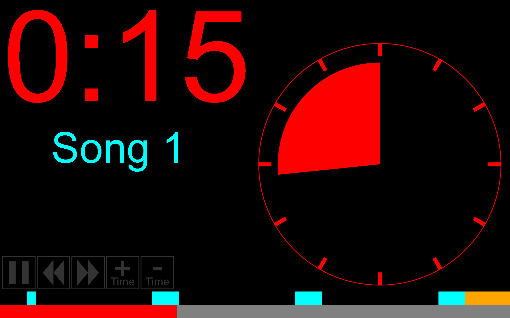

# Course Structure

## Screenshot

| Setup screen                            | Running screen             |
|-----------------------------------------|----------------------------|
|  |  |

## Description

This is a small tool, incorporating a specialized stopwatch, and a music player,
designed to help with hosting West Coast Swing lessons, with a pre-defined strict
structure. It is especially useful to help instructors keep control over the passage
of time, and also useful in a setting where multiple parallel lessons take place in
the same room.

## How to Use

In order to use, please go to https://purdeaandrei.github.io/course_structure/
And click on "Click to add music to the playlist" to select at least one music
file from your system, but ideally at least as many music sections there are in
the structure. (You may also drag-and-drop music files over the webpage).

If some of the songs have long intros that you would like to skip, then please set
the OffsetSeconds column to something other than 0.

Optionally the pre-defined structure may be edited, or the overlay sounds may be
customized.

When ready, click START.

It is recommended to put the browser into full-screen mode at this stage.

You may use the on-screen navigation buttons (if they have been enabled), to pause
and/or to skip or go back to sections.

In order to prevent your device from going to sleep, a wake lock has been implemented,
and you can see it's status underneath the start button. If it says "OK", then
it will probably be able to prevent your screensaver, screen sleep, or automated
suspend from engaging, otherwise please make sure that these mechanisms are disabled.
The wake lock support is limited to a handful of browsers, please see:
https://caniuse.com/wake-lock

## Using offline

This tool, in it's current state, doesn't require a server to function, so you may
download it, and use it offline. If you download as a zip archive, make sure you
extract it first, before opening index.html.

* In general it is expected to work correctly on laptop/desktop operating systems.
* On Android Google Chrome, make sure you open the site using the file:// scheme.
  File managers will typically open pages using the content:// scheme, and that will
  not allow access to the sound files, and wake lock will also fail. To use the file
  scheme, please open one of these URLs, and navigate to where you have extracted the
  website.
   * file:///sdcard/
   * file:///storage/emulated/0/
   * file:///storage/emulated/0/SOMEFOLDER/ (replace SOMEFOLDER as a name of a known
     folder on your internal storage. Sometimes the top-level access doesn't work,
     but subfolders do.

## Keyboard shortcuts

The keyboard shortcuts are only enabled if "Enable keyboard shortcuts" is checked
on the setup screen. The first couple are similar to mplayer's shortcuts, but there
are also a couple specific to this application:

| Key      | Action                                                                                                                                    |
|----------|-------------------------------------------------------------------------------------------------------------------------------------------|
| F        | Toggle full screen                                                                                                                        |
| Space    | Play/Pause                                                                                                                                |
| Right    | Fast forward 10 seconds                                                                                                                   |
| Left     | Go back 10 seconds                                                                                                                        |
| Up       | Fast forward 60 seconds                                                                                                                   |
| Down     | Go Back 60 seconds                                                                                                                        |
| PageUp   | Jump to the next section                                                                                                                  |
| PageDown | Jump back to the beginning of the current section, or if close to the beginning of the current section, then jump to the previous section |
| +        | Adjust the structure such as more time (+60s) is added to the current silent section, but some time is taken away from following silence  |
| -        | Adjust the structure such the current silent section is shortened by 60 seconds, and the time is added to some following silence          |

## Credits

The idea for this project is inspired by the "Media West" organization from Israel.
(We do not imply their endorsement, we're just giving credit)
